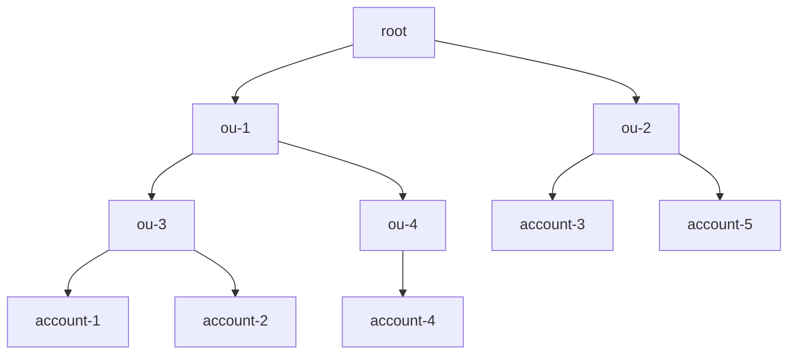

# !!! This is a "fork" of the golang bindings of the cdklabs/cdk-stacksets repo

cdklabs/cdk-stacksets does not publish the golang bindings so we had to run the `projen` manually and push them here.

Relevant issue: <https://github.com/cdklabs/cdk-stacksets/issues/623>

Also, the generated interface for `StackSetStackSynthesizer` embeds the upstream interface with a duplicate declaration of: `SynthesizeTemplate`.
Here, we have explicitly commented out `SynthesizeTemplate`.

# Build go bindings locally

```
git clone git@github.com:cdklabs/cdk-stacksets.git
cd cdk-stacksets
yarn install --check-files --frozen-lockfile
npx projen package:go
```

Go bindings will be in `dist/go/` directory.

# CDK StackSets Construct Library

<!--BEGIN STABILITY BANNER-->---


> The APIs of higher level constructs in this module are experimental and under active development.
> They are subject to non-backward compatible changes or removal in any future version. These are
> not subject to the [Semantic Versioning](https://semver.org/) model and breaking changes will be
> announced in the release notes. This means that while you may use them, you may need to update
> your source code when upgrading to a newer version of this package.

---

<!--END STABILITY BANNER-->

This construct library allows you to define AWS CloudFormation StackSets.

```go
stack := awscdk.Newstack()
stackSetStack := cdkstacksets.NewstackSetStack(stack, jsii.String("MyStackSet"))

cdkstacksets.NewStackSet(stack, jsii.String("StackSet"), &StackSetProps{
 Target: *cdkstacksets.StackSetTarget_FromAccounts(&AccountsTargetOptions{
  Regions: []*string{
   jsii.String("us-east-1"),
  },
  Accounts: []*string{
   jsii.String("11111111111"),
  },
  ParameterOverrides: map[string]*string{
   "SomeParam": jsii.String("overrideValue"),
  },
 }),
 Template: *cdkstacksets.StackSetTemplate_FromStackSetStack(stackSetStack),
})
```

## Installing

### TypeScript/JavaScript

```bash
npm install cdk-stacksets
```

### Python

```bash
pip install cdk-stacksets
```

### Java

```xml
// add this to your pom.xml
<dependency>
    <groupId>io.github.cdklabs</groupId>
    <artifactId>cdk-stacksets</artifactId>
    <version>0.0.0</version> // replace with version
</dependency>
```

### .NET

```bash
dotnet add package CdklabsCdkStacksets --version X.X.X
```

### Go

```bash
go get cdk-stacksets-go
```

## Creating a StackSet Stack

StackSets allow you to deploy a single CloudFormation template across multiple AWS accounts and regions.
Typically when creating a CDK Stack that will be deployed across multiple environments, the CDK will
synthesize separate Stack templates for each environment (account/region combination). Because of the
way that StackSets work, StackSet Stacks behave differently. For Stacks that will be deployed via StackSets
a single Stack is defined and synthesized. Any environmental differences must be encoded using Parameters.

A special class was created to handle the uniqueness of the StackSet Stack.
You declare a `StackSetStack` the same way that you declare a normal `Stack`, but there
are a couple of differences. `StackSetStack`s have a couple of special requirements/limitations when
compared to Stacks.

_Requirements_

- Must be created in the scope of a `Stack`
- Must be environment agnostic

_Limitations_

- Does not support Docker container assets

Once you create a `StackSetStack` you can create resources within the stack.

```go
stack := awscdk.Newstack()
stackSetStack := cdkstacksets.NewstackSetStack(stack, jsii.String("StackSet"))

awscdk.Aws_iam.NewRole(stackSetStack, jsii.String("MyRole"), &RoleProps{
 AssumedBy: awscdk.*Aws_iam.NewServicePrincipal(jsii.String("myservice.amazonaws.com")),
})
```

Or

```go
type myStackSet struct {
 stackSetStack
}

func newMyStackSet(scope construct, id *string) *myStackSet {
 this := &myStackSet{}
 newStackSetStack_Override(this, scope, id)

 awscdk.Aws_iam.NewRole(this, jsii.String("MyRole"), &RoleProps{
  AssumedBy: awscdk.*Aws_iam.NewServicePrincipal(jsii.String("myservice.amazonaws.com")),
 })
 return this
}
```

## Creating a StackSet

AWS CloudFormation StackSets enable you to create, update, or delete stacks across multiple accounts and AWS Regions
with a single operation. Using an administrator account, you define and manage an AWS CloudFormation template, and use
the template as the basis for provisioning stacks into selected target accounts across specific AWS Regions.

There are two methods for defining _where_ the StackSet should be deployed. You can either define individual accounts, or
you can define AWS Organizations organizational units.

### Deploying to individual accounts

Deploying to individual accounts requires you to specify the account ids. If you want to later deploy to additional accounts,
or remove the stackset from accounts, this has to be done by adding/removing the account id from the list.

```go
stack := awscdk.Newstack()
stackSetStack := cdkstacksets.NewstackSetStack(stack, jsii.String("MyStackSet"))

cdkstacksets.NewStackSet(stack, jsii.String("StackSet"), &StackSetProps{
 Target: *cdkstacksets.StackSetTarget_FromAccounts(&AccountsTargetOptions{
  Regions: []*string{
   jsii.String("us-east-1"),
  },
  Accounts: []*string{
   jsii.String("11111111111"),
  },
 }),
 Template: *cdkstacksets.StackSetTemplate_FromStackSetStack(stackSetStack),
})
```

### Deploying to organizational units

AWS Organizations is an AWS service that enables you to centrally manage and govern multiple accounts.
AWS Organizations allows you to define organizational units (OUs) which are logical groupings of AWS accounts.
OUs enable you to organize your accounts into a hierarchy and make it easier for you to apply management controls.
For a deep dive on OU best practices you can read the [Best Practices for Organizational Units with AWS Organizations](https://aws.amazon.com/blogs/mt/best-practices-for-organizational-units-with-aws-organizations/) blog post.

You can either specify the organization itself, or individual OUs. By default the StackSet will be deployed
to all AWS accounts that are part of the OU. If the OU is nested it will also deploy to all accounts
that are part of any nested OUs.

For example, given the following org hierarchy



You could deploy to all AWS accounts under OUs `ou-1`, `ou-3`, `ou-4` by specifying the following:

```go
stack := awscdk.Newstack()
stackSetStack := cdkstacksets.NewstackSetStack(stack, jsii.String("MyStackSet"))

cdkstacksets.NewStackSet(stack, jsii.String("StackSet"), &StackSetProps{
 Target: *cdkstacksets.StackSetTarget_FromOrganizationalUnits(&OrganizationsTargetOptions{
  Regions: []*string{
   jsii.String("us-east-1"),
  },
  OrganizationalUnits: []*string{
   jsii.String("ou-1"),
  },
 }),
 Template: *cdkstacksets.StackSetTemplate_FromStackSetStack(stackSetStack),
})
```

This would deploy the StackSet to `account-1`, `account-2`, `account-4`.

If there are specific AWS accounts that are part of the specified OU hierarchy that you would like
to exclude, this can be done by specifying `excludeAccounts`.

```go
stack := awscdk.Newstack()
stackSetStack := cdkstacksets.NewstackSetStack(stack, jsii.String("MyStackSet"))

cdkstacksets.NewStackSet(stack, jsii.String("StackSet"), &StackSetProps{
 Target: *cdkstacksets.StackSetTarget_FromOrganizationalUnits(&OrganizationsTargetOptions{
  Regions: []*string{
   jsii.String("us-east-1"),
  },
  OrganizationalUnits: []*string{
   jsii.String("ou-1"),
  },
  ExcludeAccounts: []*string{
   jsii.String("account-2"),
  },
 }),
 Template: *cdkstacksets.StackSetTemplate_FromStackSetStack(stackSetStack),
})
```

This would deploy only to `account-1` & `account-4`, and would exclude `account-2`.

Sometimes you might have individual accounts that you would like to deploy the StackSet to, but
you do not want to include the entire OU. To do that you can specify `additionalAccounts`.

```go
stack := awscdk.Newstack()
stackSetStack := cdkstacksets.NewstackSetStack(stack, jsii.String("MyStackSet"))

cdkstacksets.NewStackSet(stack, jsii.String("StackSet"), &StackSetProps{
 Target: *cdkstacksets.StackSetTarget_FromOrganizationalUnits(&OrganizationsTargetOptions{
  Regions: []*string{
   jsii.String("us-east-1"),
  },
  OrganizationalUnits: []*string{
   jsii.String("ou-1"),
  },
  AdditionalAccounts: []*string{
   jsii.String("account-5"),
  },
 }),
 Template: *cdkstacksets.StackSetTemplate_FromStackSetStack(stackSetStack),
})
```

This would deploy the StackSet to `account-1`, `account-2`, `account-4` & `account-5`.

### StackSet permissions

There are two modes for managing StackSet permissions (i.e. _where_ StackSets can deploy & _what_ resources they can create).
A StackSet can either be `Service Managed` or `Self Managed`.

You can control this through the `deploymentType` parameter.

#### Service Managed

When a StackSet is service managed, the permissions are managed by AWS Organizations. This allows the StackSet to deploy the Stack to _any_
account within the organization. In addition, the StackSet will be able to create _any_ type of resource.

```go
stack := awscdk.Newstack()
stackSetStack := cdkstacksets.NewstackSetStack(stack, jsii.String("MyStackSet"))

cdkstacksets.NewStackSet(stack, jsii.String("StackSet"), &StackSetProps{
 Target: *cdkstacksets.StackSetTarget_FromOrganizationalUnits(&OrganizationsTargetOptions{
  Regions: []*string{
   jsii.String("us-east-1"),
  },
  OrganizationalUnits: []*string{
   jsii.String("ou-1"),
  },
 }),
 DeploymentType: *cdkstacksets.DeploymentType_ServiceManaged(),
 Template: *cdkstacksets.StackSetTemplate_FromStackSetStack(stackSetStack),
})
```

When you specify `serviceManaged` deployment type, automatic deployments are enabled by default.
Automatic deployments allow the StackSet to be automatically deployed to or deleted from
AWS accounts when they are added or removed from the specified organizational units.

### Using File Assets

You can use the StackSet's parent stack to facilitate file assets. Behind the scenes,
this is accomplished using the `BucketDeployment` construct from the
`aws_s3_deployment` module. You need to provide a list of buckets outside the scope of the CDK
managed asset buckets and ensure you have permissions for the target accounts to pull
the artifacts from the supplied bucket(s).

As a basic example, if using a `serviceManaged` deployment, you just need to give read
access to the Organization. You can create the asset bucket in the parent stack, or another
stack in the same app and pass the object as a prop. Or, import an existing bucket as needed.

If creating in the parent or sibling stack you could create and export similar to this:

```go
bucket := awscdk.Aws_s3.NewBucket(this, jsii.String("Assets"), &BucketProps{
 BucketName: jsii.String("prefix-us-east-1"),
})

bucket.AddToResourcePolicy(
awscdk.Aws_iam.NewPolicyStatement(&PolicyStatementProps{
 Actions: []*string{
  jsii.String("s3:Get*"),
  jsii.String("s3:List*"),
 },
 Resources: []*string{
  bucket.ArnForObjects(jsii.String("*")),
  bucket.BucketArn,
 },
 Principals: []iPrincipal{
  awscdk.*Aws_iam.NewOrganizationPrincipal(jsii.String("o-xyz")),
 },
}))
```

Then pass as a prop to the StackSet stack:

```go
var bucket bucket

stack := awscdk.Newstack()
stackSetStack := cdkstacksets.NewstackSetStack(stack, jsii.String("MyStackSet"), &StackSetStackProps{
 AssetBuckets: []iBucket{
  bucket,
 },
 AssetBucketPrefix: jsii.String("prefix"),
})
```

To faciliate multi region deployments, there is an assetBucketPrefix property. This
gets added to the region the Stack Set is deployed to. The stack synthesis for
the Stack Set would look for a bucket named `prefix-{Region}` in the example
above. `{Region}` is whatever region you are deploying the Stack Set to as
defined in your target property of the StackSet. You will need to ensure the
bucket name is correct based on what was previously created and then passed in.

You can use self-managed StackSet deployments with file assets too but will
need to ensure all target accounts roles will have access to the central asset
bucket you pass as the property.

## Deploying StackSets using CDK Pipelines

You can also deploy StackSets using [CDK Pipelines](https://docs.aws.amazon.com/cdk/api/v2/docs/aws-cdk-lib.pipelines-readme.html)

Below is an example of a Pipeline that deploys from a central account. It also
defines separate stages for each "environment" so that you can first test out
the stackset in pre-prod environments.

This would be an automated way of deploying the bootstrap stack described in
[this blog
post](https://aws.amazon.com/blogs/mt/bootstrapping-multiple-aws-accounts-for-aws-cdk-using-cloudformation-stacksets/).

```go
var app app

type bootstrapStageProps struct {
 stageProps
 initialBootstrapTarget stackSetTarget
 stacksetName *string
}

type bootstrapStage struct {
 stage
}

func newBootstrapStage(scope construct, id *string, props bootstrapStageProps) *bootstrapStage {
 this := &bootstrapStage{}
 newStage_Override(this, scope, id, props)

 stack := awscdk.Newstack(this, jsii.String("BootstrapStackSet"))

 bootstrap := NewBootstrap(stack, jsii.String("CDKToolkit"))

 stackSet := cdkstacksets.NewStackSet(stack, jsii.String("StackSet"), &StackSetProps{
  Template: *cdkstacksets.StackSetTemplate_FromStackSetStack(bootstrap),
  Target: props.initialBootstrapTarget,
  Capabilities: []capability{
   *cdkstacksets.Capability_NAMED_IAM,
  },
  ManagedExecution: jsii.Boolean(true),
  StackSetName: props.stacksetName,
  DeploymentType: *cdkstacksets.DeploymentType_ServiceManaged(&ServiceManagedOptions{
   DelegatedAdmin: jsii.Boolean(true),
   AutoDeployEnabled: jsii.Boolean(true),
   AutoDeployRetainStacks: jsii.Boolean(false),
  }),
  OperationPreferences: &OperationPreferences{
   RegionConcurrencyType: *cdkstacksets.RegionConcurrencyType_PARALLEL,
   MaxConcurrentPercentage: jsii.Number(100),
   FailureTolerancePercentage: jsii.Number(99),
  },
 })
 return this
}

pipeline := awscdk.Pipelines.NewCodePipeline(this, jsii.String("BootstrapPipeline"), &CodePipelineProps{
 Synth: awscdk.*Pipelines.NewShellStep(jsii.String("Synth"), &ShellStepProps{
  Commands: []*string{
   jsii.String("yarn install --frozen-lockfile"),
   jsii.String("npx cdk synth"),
  },
  Input: awscdk.*Pipelines.CodePipelineSource_Connection(jsii.String("myorg/myrepo"), jsii.String("main"), &ConnectionSourceOptions{
   ConnectionArn: jsii.String("arn:aws:codestar-connections:us-east-2:111111111111:connection/ca65d487-ca6e-41cc-aab2-645db37fdb2b"),
  }),
 }),
 SelfMutation: jsii.Boolean(true),
})

regions := []*string{
 "us-east-1",
 "us-east-2",
 "us-west-2",
 "eu-west-2",
 "eu-west-1",
 "ap-south-1",
 "ap-southeast-1",
}

pipeline.AddStage(
NewBootstrapStage(app, jsii.String("DevBootstrap"), &bootstrapStageProps{
 env: &Environment{
  Region: jsii.String("us-east-1"),
  Account: jsii.String("111111111111"),
 },
 stacksetName: jsii.String("CDKToolkit-dev"),
 initialBootstrapTarget: *cdkstacksets.StackSetTarget_FromOrganizationalUnits(&OrganizationsTargetOptions{
  Regions: *Regions,
  OrganizationalUnits: []*string{
   jsii.String("ou-hrza-ar333427"),
  },
 }),
}))

pipeline.AddStage(
NewBootstrapStage(app, jsii.String("ProdBootstrap"), &bootstrapStageProps{
 env: &Environment{
  Region: jsii.String("us-east-1"),
  Account: jsii.String("111111111111"),
 },
 stacksetName: jsii.String("CDKToolkit-prd"),
 initialBootstrapTarget: *cdkstacksets.StackSetTarget_*FromOrganizationalUnits(&OrganizationsTargetOptions{
  Regions: *Regions,
  OrganizationalUnits: []*string{
   jsii.String("ou-hrza-bb999427"),
   jsii.String("ou-hraa-ar111127"),
  },
 }),
}))
```
